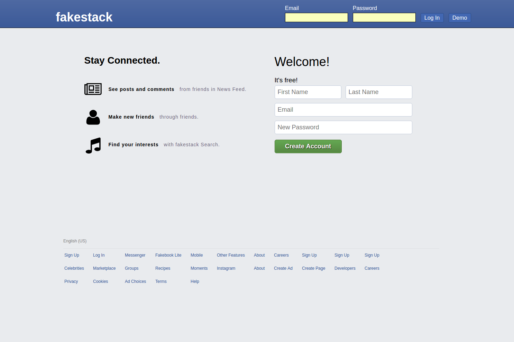
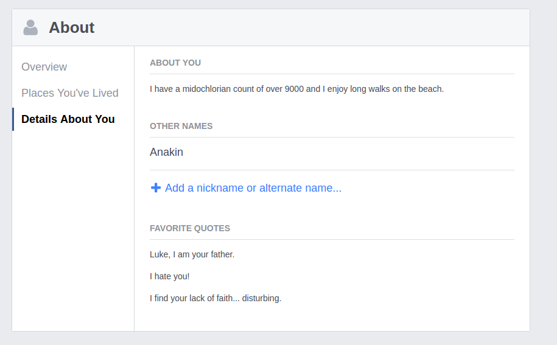
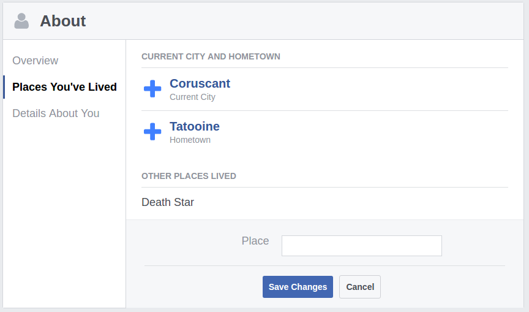

# Fakestack

[Fakestack live][heroku]

[heroku]: http://www.fakestack.us/

Fakestack is a full-stack web app clone intended to replicate many of the features of Facebook as well replicates its UI design as accurately as possible. The back-end framework was built using Ruby on Rails utilizing a PostgreSQL dataabase, and the front-end was built using React/Redux framework.




## Features & Implementation  

### Friending and Denormalization

  In order to test scalability, over two thousand profiles have been seeded in both the production and development database. Friendships were generated randomly by script setting each user to have about 100 friend relationships and 20 request relationships leading to a total of 225936 entries in the 'Friending' table. This resulted in an incredibly slow response time upwards of 13-17 seconds to render a user profile completely as it involves loading all of the user's friends which is queried through the now super-inflated 'Friending' table.

  What was my solution to this? Denormalization! By extracting all of a user's friends and converting into a hash and then serializing it and storing it in a single field on the users table, I managed to drive down the profile rendering time back down to around 250ms, a 97% reduction in response time! What are the drawbacks? Because we're effectively storing redundant data, about 10mb of extra memory was required to store these large 'friends' hashes for 2000 users (averaging 5 extra kilobytes per user). On top of that, there's now extra overhead involved in writing and deleting friendships due to the fact that we now have to update the denormalized data along with updating the Friending table. Although considering the fact that the expected use case is that friendship reads are far more common than friendships writes and inn context of the optimization gains that were captured, the trade-off is very acceptable.


### Posts and Comments

  Posts exists both as a top-level state on the front-end as well as a model/table on the back-end. It has columns pertaining to `author_id`, `id`, `location_id`, and `content`. Comments are similar except that their `location_id` is replaced with a `parent_id.` To allow for the nested replies available in facebook, comments are set up to have a polymorphic association where it's parent may be a post or another comment.

  On viewing a target user's wall (it may be the current user), all posts referencing the target user's `id` as it's `location_id` are fetched using a simple SQL query. Each post object, will also include an `comments` array of ids referencing the comments belonging to the post through an association. Comments are similarly imported except that their "child comments" (known as `replies`) are stored as an array of objects instead of references.

  Both comments and posts are made available as top-level resources on the front-end and are accessed by reference ids as needed.

### Profiles

  On the database side, all profile details are almost all stored as columns within the users table, using a variety of data-types including, text, string and with some fields such as `places` existing as an array.

  All of the profile information is stored on the front-end under a single `userProfile` top-level state. Information is fetched using an api call to the `users/show` route. The JSON response will include relationship information as along with profile information stored in the user table.

  Limited photo upload capability is provided through Cloudinary widgets to allow for users to upload profile pictures and cover images.

  It presented a significant challenge to generate uniformly styled forms, displays, and functions for what amounted to about 7 different profile details. To address this, modular components were created to handle similar data-types. At cost of some overhead development time to generate a more complex, but modular component, I was able to successfully use quickly generate similar displays for different profile details.

```Javascript

  let profileInfoCurrentCity = {editCheck: editCheck,
                       instruction: "Add your current city",
                       inputLabel: "Current City",
                       propName: "current_city",
                       value: this.props.viewedUserProfile.currentCity}


  <UnitForm profileInfo={profileInfoCurrentCity}
    viewedUserProfile={this.props.viewedUserProfile}
    updateProp={this.props.updateProp} />
  <UnitForm profileInfo={profileInfoHometown}
    viewedUserProfile={this.props.viewedUserProfile}
    updateProp={this.props.updateProp} />
  ```






## Future Direction

Part of the reason I chose to replicate Facebook was due to the wide variety of features it offers. I plan on continuing to work on this project and expands its features as way to build experience with working with large projects with many inter-locking parts. The features I plan to implement in the near future are outlined as follows.

### Autocomplete

In filling out certain profile details like hometown or current city, Facebook has an autocomplete feature that will predict the input and provide an image/link that will be used auto-fill the field. Facebook uses this in many of its components. I plan to utilize various third-party-apis to achieve a similar effect.

### Photos

I also plan to implement photo features across different components
